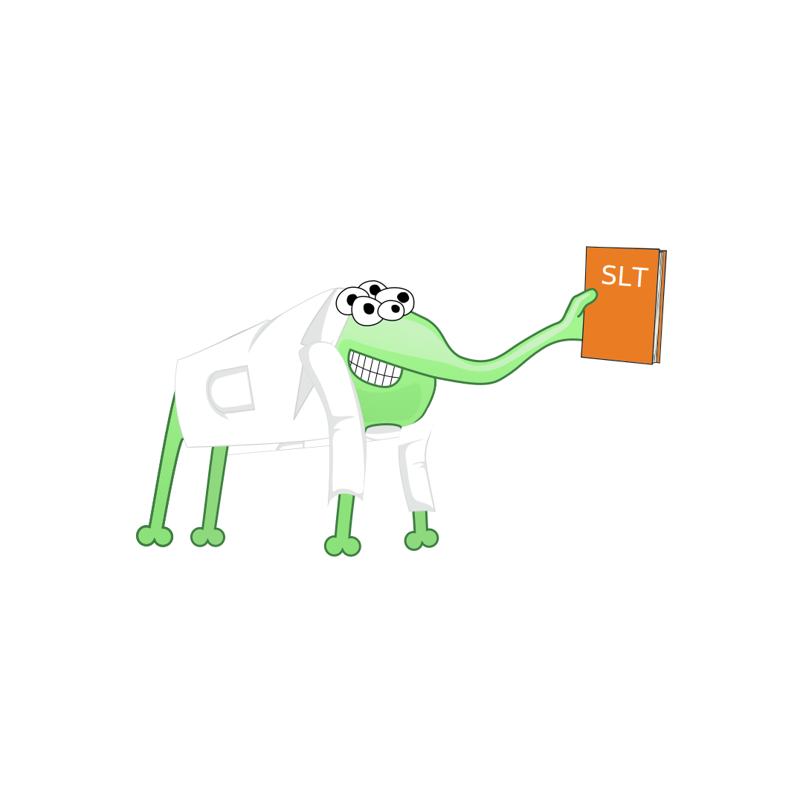

# SLT - A Common Lisp Language Plugin for Jetbrains IDE lineup

**THIS PLUGIN IS EXPERIMENTAL and can crash at any time! Please report all bugs!**

This plugin is providing support for Common Lisp for JetBrains IDEs. 
Using modified SLIME/Swank protocol to commmunicate with SBCL providing 
IDE capabilities for Common Lisp.

# (Somewhat)Detailed Installation and Usage Guide

https://github.com/Enerccio/SLT/wiki/User-Guide

## Requirements

1) Intellij based IDE - tested on `Intellij Idea Community/Ultimate` but should work on all major IDEs
   1) Versions supported are from 2022.2 and upwards 

Optionally (see more - guide):

1) [Steel Bank Common Lisp](https://www.sbcl.org/) installed
2) [Quicklisp](https://www.quicklisp.org/beta/) installed

## Getting started

See https://github.com/Enerccio/SLT/wiki/User-Guide#plugin-installation

## Plugin options

- See guide above for SDK
- For changing colors https://github.com/Enerccio/SLT/wiki/User-Guide#change-colors-of-elements
- For changing indent https://github.com/Enerccio/SLT/wiki/User-Guide#change-indentation-settings

## Compiling source

Clone the repository and change gradle.properties for your IDE. 
Then use gradle to build the plugin. 
You can also open this as a project in Intellij Idea.

## Planned features / goals

* [ ] Upload to marketplace when it has enough features
* [x] Automatic indentation
* [x] REPL
* [x] Interactive debugging
* [x] Argument help (Ctrl+P)
* [ ] Inspection
  * [x] Basic inspection
  * [ ] Actions
  * [ ] Inspection eval
* [ ] Walkable debugger without actions 
  * [ ] Breakpoints
  * Currently impossible to do correctly with sbcl, investigating other options
* [x] Documentation 
* [x] Macro expand in documentation
  * Macro expand requires you to hover element twice for now
* [x] Find function by symbol name
* [x] Search for symbols
* [x] Back references 
* [ ] Refactoring
* [ ] List of quicklisp installed packages / ASDF packages
* [ ] List of modified top level forms that are yet to be evaluated
* [ ] Actually make an IDE, ie just plugin with dependencies as one application, not a plugin

### Far futures / possible goals 

* [x] SDK Support 
  * not a true SDK because that is only available in Intellij and not in  (for instance) PyCharm, thus
this is implemented manually.
  * [x] Download SBCL and quicklisp for user
* [x] Automatic download of lisp interpret and quicklisp
* [ ] Different lisp interpreter support 
* [ ] Remote connections to interpreters
* [ ] Rewrite everything into ABCL just for purity’s sake lol

## License

This project is licensed under [Apache License v2](LICENSE.txt).

### What does SLT even mean?

SLT - Speech Language Therapy. Only cure for LISP!

Also, backronym for Superior Lisp Tooling!